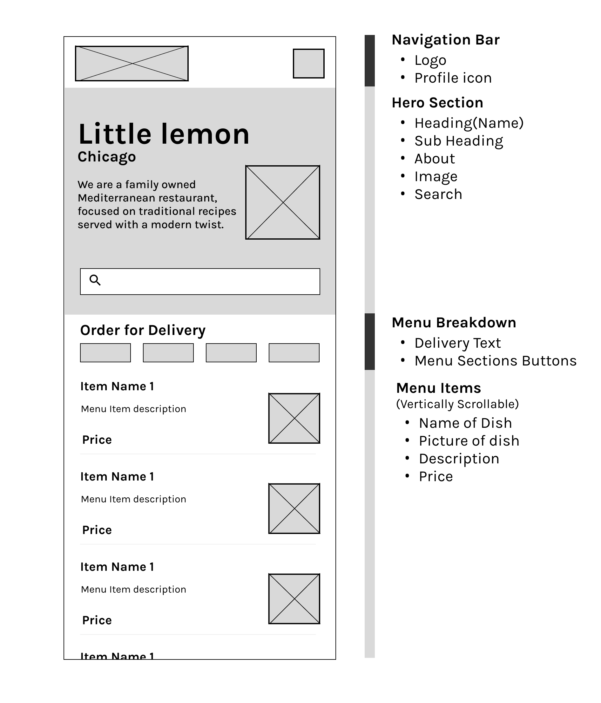

# Little Lemon Restaurant App 🍋

A modern, feature-rich mobile application for **Little Lemon**, a family-owned
Mediterranean restaurant. This app provides a seamless user experience from
onboarding to exploring the menu and managing a personal profile.

Built as part of the **Meta Front-End / Mobile Developer Professional
Certificate** on Coursera.

---

## Features

- **Onboarding Experience**: A dedicated onboarding flow that captures user
  information (First Name, Last Name, Email) and persists it locally.
- **Dynamic Menu**:
  - Fetches real-time menu data from a remote API.
  - Interactive categories filter (Starters, Mains, Desserts, Drinks).
  - Real-time search functionality to find your favorite dishes instantly.
- **Local Persistence**: Uses **SQLite** for storing and caching menu items and
  user data, ensuring the app works offline after the initial sync.
- **User Profiles**:
  - Custom profile management.
  - Profile picture integration using `expo-image-picker`.
  - Persistence of user preferences and contact details.
- **Modern UI/UX**:
  - Clean, branded design using the Little Lemon color palette (`#495E57` Green,
    `#F4CE14` Yellow).
  - Responsive layouts with `SafeAreaView`.
  - Smooth transitions and loading states.

---

## Technology Stack

- **Framework**: [React Native](https://reactnative.dev/) with
  [Expo](https://expo.dev/) (SDK 54)
- **Navigation**: [Expo Router](https://docs.expo.dev/router/introduction/)
  (Link-based routing with Tab navigation)
- **Database**: [expo-sqlite](https://docs.expo.dev/versions/latest/sdk/sqlite/)
  for local data storage
- **UI Components**: [react-native-paper](https://reactnativepaper.com/) and
  Vanilla CSS
- **Icons**: [MaterialCommunityIcons](https://icons.expo.fyi/)
- **Image Handling**: `expo-image-picker` and `expo-image`

---

## Design & Wireframes

The app layout and design were carefully planned to match the Little Lemon brand
identity.



---

## Installation & Setup

1. **Clone the repository**:

   ```bash
   git clone https://github.com/ksindesign/little-lemon-rn.git
   cd little-lemon-rn
   ```

2. **Install dependencies**:

   ```bash
   npm install
   ```

3. **Start the development server**:

   ```bash
   npx expo start
   ```

4. **Run on a device or emulator**:
   - Scan the QR code with the **Expo Go** app (Android) or Camera app (iOS).
   - Press `i` for iOS simulator or `a` for Android emulator in the terminal.

---

## Project Structure

- `app/`: Contains the main application routes and screens (using Expo Router).
  - `(tabs)/`: Tab-based navigation (`HomeScreen`, `ProfileScreen`).
  - `OnboardingScreen.tsx`: Initial user setup.
  - `utils/database.ts`: SQLite database initialization and helper functions.
- `assets/`: Images, logos, and fonts.
- `components/`: Reusable UI components like `MenuFilter`, `Searchbar`, and
  `ImagePicker`.
